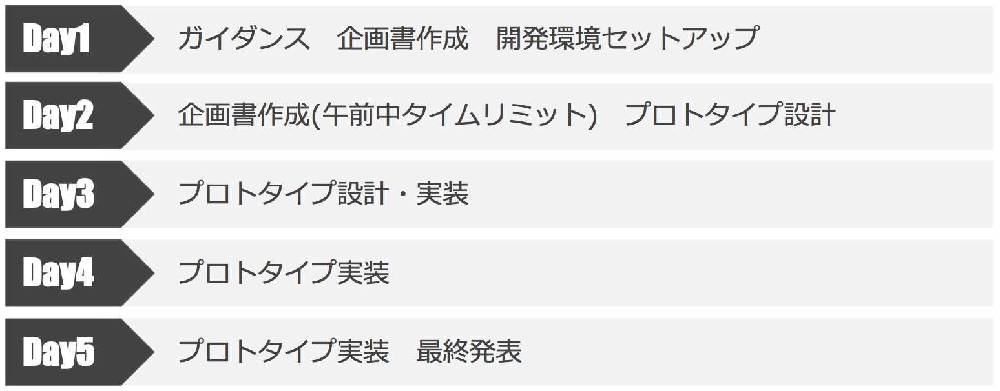
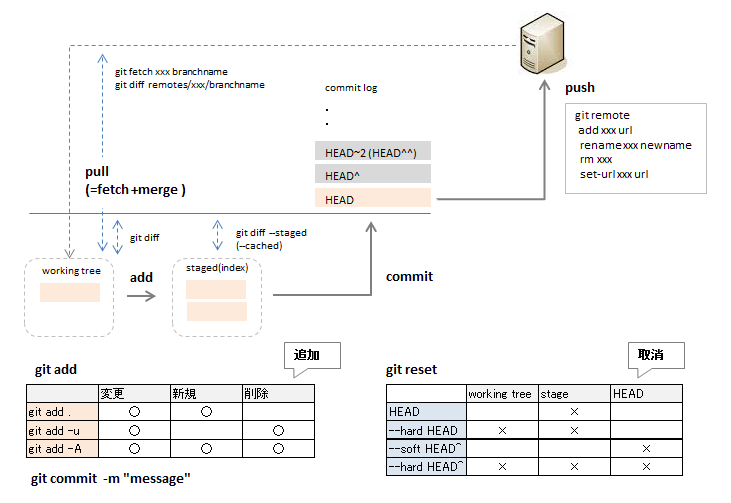

# Internship Program

Internship Program Material

* [Program Tutorial](https://docs.google.com/presentation/d/1Us7osvZ7Q8Axx3fMVzzsHn3ASmV2pOcCVR5eckx-rEc/edit?usp=sharing)
* [Presentation Material](https://docs.google.com/presentation/d/14eGoUcWjr9JkcgVFv14PI8xXpjvtkCS2VMJWU9_fYSk/edit?usp=sharing)

## Schedule

## Environment Setup

開発には、基本的にPythonを利用します。また、ソースコードの管理にはGitを利用します。そのため、そのための環境をセットアップします。

* [Python Setup](http://qiita.com/icoxfog417/items/950b8af9100b64c0d8f9)
* [Git Setup](https://git-scm.com/downloads)
* [GitHub Account Setup](https://github.com/)

## Elementary Knowledge

* [Python Exercise](https://github.com/icoxfog417/python_exercises)
  * [and more!](http://qiita.com/icoxfog417/items/3a5d1d31632a7225f92a#_reference-2cbe716b9e4b8408c088)
* [Git Tutorial](http://qiita.com/icoxfog417/items/617094c6f9018149f41f)

## Additional Knowledge

* Machine Learning
  * [Basic](https://github.com/icoxfog417/baby_steps_of_machine_learning)
  * [Convolutional Neural Network](http://qiita.com/icoxfog417/items/5aa1b3f87bb294f84bac)
  * [Reinforcement Learning](https://github.com/icoxfog417/techcircle_openai_handson)
  * [OpenCV](http://qiita.com/icoxfog417/items/53e61496ad980c41a08e)
* [Web Application](https://www.slideshare.net/takahirokubo7792/web-application-tutorial)
* [Bot](http://qiita.com/Hironsan/items/0373339388f460cebb08)
